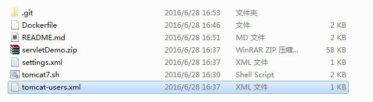
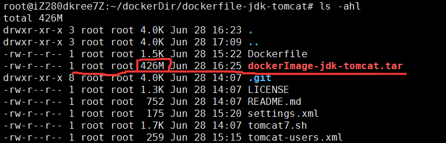
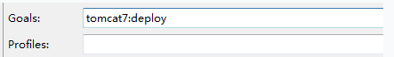

# docker-jdk-tomcat

##docker 部署
一个 Dockerfile 包含有了 jdk7, tomcat7 和一个利用Maven远程部署到镜像中的servlet项目
###目录结构


### 前提条件

 [安装Docker](https://docs.docker.com/engine/getstarted/)

### 使用方式

build一个新的镜像
```
$ git clone https://github.com/wangmax0330/docker-jdk-tomcat.git
$ cd docker-jdk-tomcat
$ sudo docker build -t docker-jdk-tomcat .
```

运行镜像
```
$ sudo docker run -d -p 8090:8080 docker-jdk-tomcat
```
打开`http://<host>:8090`可以看到tomcat 首页

###将镜像导出成tar的大小

 
 总体来说,400多兆还是很小的

###常用命令

* 进去运行时的容器
```
$ docker exec -it <contain id> /bin/bash
```
* 列出当前所有正在运行的container  
```
$docker ps  
```
* 列出所有的container  (包括历史)
```
$docker ps -a  
```
* 列出最近一次启动的container  
```
$docker ps -l  
```

* 保存和加载镜像（save、load）
当需要把一台机器上的镜像迁移到另一台机器的时候，需要保存镜像与加载镜像。
	* 保存镜像到一个tar包; -o, --output="" Write to an file  
	```bash
	$docker save image_name -o file_path  
	```

	* 加载一个tar包格式的镜像; -i, --input="" Read from a tar archive file  
	```bash
	$docker load -i file_path  
	```
	
--------------------------
##通过Maven 远程部署Tomcat 项目到容器里面
Dockerfile在初始化时需要把配置文件**settings.xml**, **tomcat-users.xml**加入进去
```
# -----------------添加自定义配置文件 begin---------------
ADD settings.xml /opt/tomcat7/conf/
ADD tomcat-users.xml /opt/tomcat7/conf/
# -----------------添加自定义配置文件  end--------------- 
```
tomcat-users.xml配置
```
<?xml version='1.0' encoding='utf-8'?>
<tomcat-users>
<role rolename="manager-gui"/>
<role rolename="manager-gui"/>
<role rolename="manager-script"/>
<user username="username" password="password" roles="manager,manager-gui,manager-script" />
</tomcat-users>
```
setting.xml配置
```
<?xml version="1.0" encoding="UTF-8"?>
<settings>
<servers> 
<server>
<id>TomcatServer</id>
<username>username</username>
<password>password</password>
</server> 
</servers>
```
需要部署的maven项目pom.xml配置tomcat插件
```xml
<plugin>
	<groupId>org.apache.tomcat.maven</groupId>
	<artifactId>tomcat7-maven-plugin</artifactId>
	<version>2.2</version>
	<configuration>
		<url>http://IP:8090/manager/text</url>
		<server>TomcatServer</server>
		<path>/sample</path>
		<username>username</username>
		<password>password</password>
	</configuration>
</plugin>
```
Maven Build



